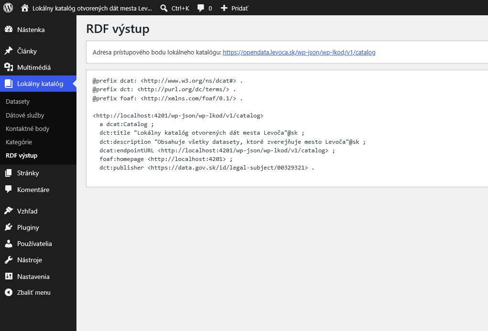

# Integračná príručka
Tento dokument slúži ako integračná príručka pre rozšírenie Lokálny katalóg otvorených dát pre redakčný systém WordPress.

Popisovaný produkt má jedno integračné rozhranie podľa špecifikácie rozhrania katalógu otvorených dát DCAT-AP-SK 3.0.0:
https://htmlpreview.github.io/?https://github.com/slovak-egov/centralny-model-udajov/blob/develop/tbox/national/dcat-ap-sk/index.html

Prístupový bod tohto integračného rozhrania je obvykle dostupný na relatívnom URL v závislosti od nastavení redakčného systému (napr. /index.php?rest_route=/wp-lkod/v1/catalog alebo /wp-json/wp-lkod/v1/catalog). Okrem hlavného prístupového bodu lokálneho katalógu sú integračných výstupom aj DCAT-AP dokumenty metadát datasetov. Adresy týchto dokumentov sú spravidla uvedené v dokumente publikovanom na prístupovom bode lokálneho katalógu.

Všetky metadáta tohto rozhrania sú dostupné vo formáte RDF 1.1 Turtle.

Rozhranie môže byť dočasne alebo trvale deaktivované v závislosti od nastavení lokálneho katalógu otvorených dát. Viac informácií je možné nájsť v konfiguračnej príručke.

Pre úspešnú registráciu lokálneho katalógu otvorených dát v rámci Národného katalógu otvorených dát (NKOD; https://data.slovensko.sk/) je potrebné poznať presnú adresu prístupového bodu lokálneho katalógu.
Táto adresa je uvedená v module Lokálny katalóg > RDF výstup a v rámci nastavení. 

