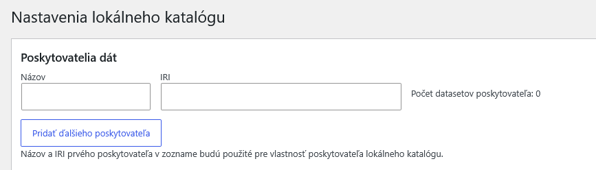
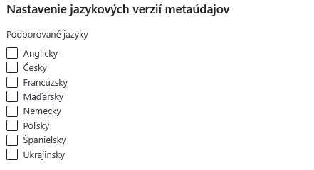
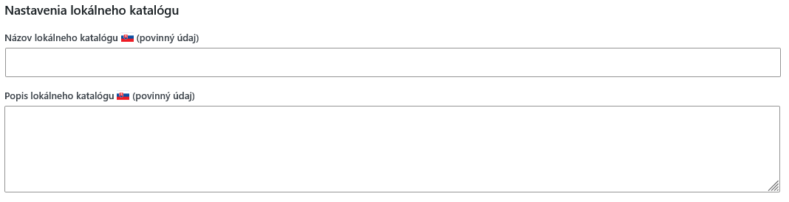
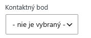
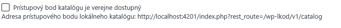
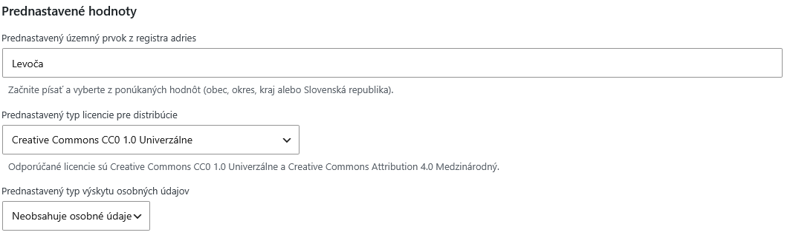
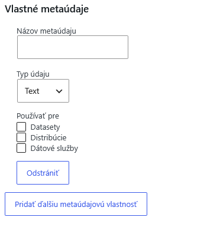

# Konfiguračná príručka a pokyny pre diagnostiku
Tento dokument slúži ako konfiguračná príručka pre rozšírenie Lokálny katalóg otvorených dát pre redakčný systém WordPress.
Po úspešnej inštalácii pluginu je potrebné vykonať konfiguráciu nového lokálneho katalógu otvorených dát.

Pre úspešnú konfiguráciu budete potrebovať:
1. IČO poskytovateľov dát, pre ktoré budú vznikať datasety v lokálnom katalógu. Ak je poskytovateľov viac, tak je potrebné vybrať jedného, ktorý bude hlavným poskytovateľom dát. Mala by to byť organizácia, ktorá bude registrovať lokálny katalóg v Národnom katalógu otvorených dát (NKOD; https://data.slovensko.sk/).
2. Názov lokálneho katalógu, ktorý môže byť jednoduchý, napr. "Lokálny katalóg otvorených dát mesta Levoča".
3. Popis lokálneho katalógu, ktorým je krátky voľný text popisujúci, aké otvorené dáta sa dajú v katalógu nájsť. Príklad: "Obsahuje všetky datasety, ktoré zverejňuje mesto Levoča".
4. Rozhodnutie, či budú metadáta vkladané aj v inej jazykovej verzii ako je slovenský jazyk. Metadáta musia byť zadávané povinne v slovenskom jazyku a voliteľne aj v iných.
5. Odporúčame nastaviť kontakty na inštitúcie, oddelenia alebo osoby, ktoré otvorené dáta na strane poskytovateľa publikujú. Kontaktnými údajmi sú meno/názov a e-mailová adresa.
6. Druh licencie, pod ktorou budú otvorené dáta publikované. Nie je nevyhnutné, aby boli všetky otvorené dáta publikované pod jednou licenciou. Odporúčané licencie sú Creative Commons CC0 1.0 Univerzálne a Creative Commons Attribution 4.0 Medzinárodný.
7. Aký územný prvok z registra adries budete používať - je možný výber obce, okresu, kraja alebo celej SR.
8. Rozhodnutie, či budete vytvárať aj vlastné metaúdaje (mimo metaúdajov ktoré sú automaticky dostupné). Vlastné metaúdaje budú zobrazené na portáli lokálneho katalógu ale nebudú sa ďalej prenášať na data.slovensko.sk a európsky portál otvorených dát.

Všetky nastavenia je možné dodatočne zmeniť, ale odporúčame nastaviť správne hodnoty pred vložením samotných metadát otvorených údajov - datasetov, distribúcií a dátových služieb.

Hlavné nastavenia lokálneho katalógu sa nachádzajú v administračnom rozhraní v module Nastavenia > Lokálny katalóg.

## Kontaktné údaje
Ako prvý krok odporúčame vložiť kontaktné údaje, ktoré budú uvedené pre lokálny katalóg a datasety. 
Tento krok je možné vynechať, ak poskytovateľ nehodlá uvádzať kontaktné údaje pre lokálny katalóg, datasety alebo dátové služby. V niektorých prípadoch je však uvedenie kontaktov povinné, napr. pre dátové služby sprístupňujúce datasety typu HVD (high value dataset).
Viac informácií je možné získať z aktuálnej špecifikácie rozhrania katalógu otvorených dát DCAT-AP-SK:
https://htmlpreview.github.io/?https://github.com/slovak-egov/centralny-model-udajov/blob/develop/tbox/national/dcat-ap-sk/index.html

Kontaktné údaje je možné vložiť v rámci administračného rozhrania WordPress v module Lokálny katalóg > Kontaktné body. 
Pre pridanie kontaktného bodu pokračujte stlačením tlačidla "Pridať nový kontaktný bod".
V nasledovnej obrazovke zvoľte typ kontaktu, vyplňte meno/názov a emailovú adresu a potvrďte pomocou tlačidla "Publikovať".
Vložiť je možné ľubovoľné množstvo kontaktných bodov.

## Poskytovatelia dát
Pre úspešné publikovanie lokálneho katalógu je potrebné nastaviť aspoň jedného poskytovateľa dát - jeho názov (názov organizácie) a jeho identifikátor - IRI, ktoré je potrebné zadať v tvare:
https://data.gov.sk/id/legal-subject/XXXXXXXX 
kde XXXXXXXX je identifikačné číslo organizácie (IČO) ako 8 číslic vrátane možných počiatočných núl. V prípade ak poskytovateľ nemá IČO, zadajte IČO nadradeného poskytovateľa (napr. v prípade Mestskej polície zadajte IČO mesta).

Príklad nastavenia:
Názov: Mesto Levoča
IRI: https://data.gov.sk/id/legal-subject/00329321

Nastaviť je možné viacero poskytovateľov, pričom prvý zo zoznamu je vedený ako poskytovateľ katalógu a ostatní môžu byť vybraní ako poskytovatelia konkrétnych datasetov. Ak chcete vymazať poskytovateľa alebo zmeniť IRI poskytovateľa, musíte najprv vymazať jeho datasety alebo ich priradiť inému poskytovateľovi.

## Nastavenie jazykových verzií metaúdajov
Plugin podporuje vytváranie metaúdajov vo viacerých jazykových verziách okrem slovenského jazyka. Metadáta musia byť zadávané povinne v slovenskom jazyku a voliteľne aj v iných. Jazykové verzie sa budú zobrazovať na portáli data.slovensko.sk (angličtina) a na európskom portáli otvorených dát data.europa.eu. Na portáli lokálneho katalógu vytvorenom týmto pluginom sa bude zobrazovať len slovenčina. V prípade ak chcete zobraziť aj iné jazyky, je potrebné portál preložiť <doplniť>.

## Nastavenia lokálneho katalógu - integračného výstupu katalógu
Pre správne publikovanie integračného výstupu je potrebné nastaviť názov a popis lokálneho katalógu v slovenskom jazyku a v nastavených jazykových verziách.

Príklad: 
Názov:
Lokálny katalóg otvorených dát mesta Levoča
Popis:
Obsahuje všetky datasety, ktoré zverejňuje mesto Levoča

Voliteľne je možné zvoliť kontaktný bod, ktorý bude uvedený v rámci integračného výstupu. Kontaktné body je možné spravovať v module Lokálny katalóg > Kontaktné body.

Viac informácií o týchto vlastnostiach lokálneho katalógu je možné získať zo špecifikácie rozhrania DCAT-AP-SK:
https://htmlpreview.github.io/?https://github.com/slovak-egov/centralny-model-udajov/blob/develop/tbox/national/dcat-ap-sk/index.html#trieda-katal%C3%B3g

Povolenie prístupového bodu - integračného výstupu lokálneho katalógu:

Zaškrtávacie políčko je potrebné označiť ako aktívne, ak chcete aby sa lokálny katalóg harvestoval na data.slovensko.sk. Následne je potrebné zaregistrovať lokálny katalóg na data.slovensko.sk. Adresa prístupového bodu je povinný údaj pri registrácii lokálneho katalógu. Pri a po registrácii musí byť prístupový bod katalógu dostupný - zaškrtávacie políčko aktívne v rámci týchto nastavení.

## Prednastavené hodnoty
Pre zefektívnenie tvorby datasetov je možné nastaviť hodnoty, ktoré sa automaticky predvyplnia vo formulároch správy datasetov:
Prednastavený územný prvok z registra adries - odporúčame nastaviť ak je lokálny katalóg viazaný pre určité územie - obec, mesto, kraj.
Prednastavený typ licencie pre distribúcie - odporúčané licencie sú Creative Commons CC0 1.0 Univerzálne a Creative Commons Attribution 4.0 Medzinárodný. 
Prednastavený typ výskytu osobných údajov - odporúčame zvoliť nastavenia "Neobsahuje osobné údaje".

O povinnosti a možnostiach týchto volieb je možné získať viac informácii zo špecifikácie DCAT-AP-SK:
https://htmlpreview.github.io/?https://github.com/slovak-egov/centralny-model-udajov/blob/develop/tbox/national/dcat-ap-sk/index.html

## Vlastné metaúdaje
Štruktúra metaúdajov sa riadi špecifikáciou DCAT-AP-SK. Z dôvodu zachovania kompatibility nie je možné upraviť štruktúru metaúdajov alebo vymazať niektorý metaúdaj.
Pre jednotlivé objekty (datasety, distribúcie, dátové služby) je však možné sprístupniť možnosť administrácie dodatočných metaúdajov nad rámec špecifikácie DCAT-AP-SK. Pre tieto metaúdaje platí, že nie sú súčasťou integračného výstupu, zobrazujú sa na portáli lokálneho katalógu.
Nastavenia týchto metaúdajov nie je povinné a odporúčame skontrolovať, či na tieto údaje neexistuje štandardný spôsob - existujúca vlastnosť, ktorá je súčasťou špecifikácie DCAT-AP-SK:
https://htmlpreview.github.io/?https://github.com/slovak-egov/centralny-model-udajov/blob/develop/tbox/national/dcat-ap-sk/index.html

Ako vlastný metaúdaj je možné spracovávať tieto typy údajov: text, dátum, hodnota zo zoznamu (číselníka), URL adresa a e-mailová adresa. Pre každý údaj je možné zvoliť, pre aké objekty (datasety, distribúcie, dátové služby) je takýto údaj možné definovať.
Všetky tieto údaje sú vo formulároch automaticky označené ako nepovinné. Počet vlastných metaúdajov nie je obmedzený.

